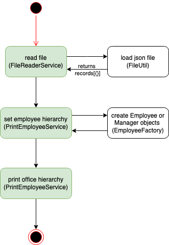
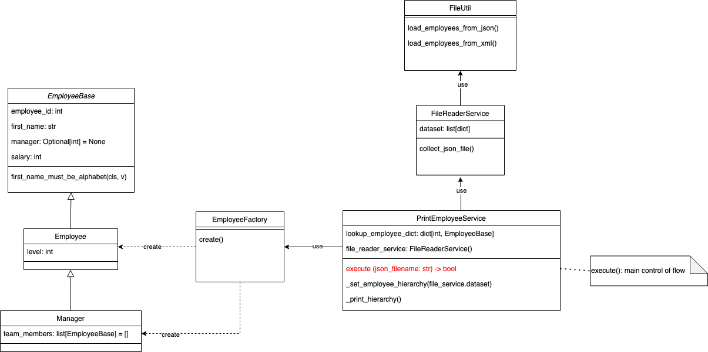
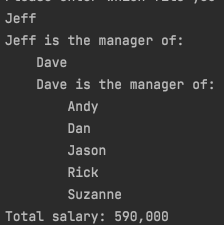

# Office Hierarchy Coding Challenge

# ENVIRONMENT
- python version 3.10.2
- pytest version 7.1.1
- pydantic version 1.9

# OBJECTIVE
- read JSON file (content: employees)
- print office hierarchy

# SYSTEM DESIGN
- Flowchart:\

- Class structure:\

# PRINT OFFICE HIERARCHY TEST FILES
To run: `python3 ./office_hierarchy/main.py`
- Enter filename:
  - employees1
  - employees2
  - employees3
  - employees4
  - employees5
  - two_top_managers

# EXAMPLE OUTPUT

# RUN PYTEST & CODE COVERAGE
To run: `pytest ./tests`\
