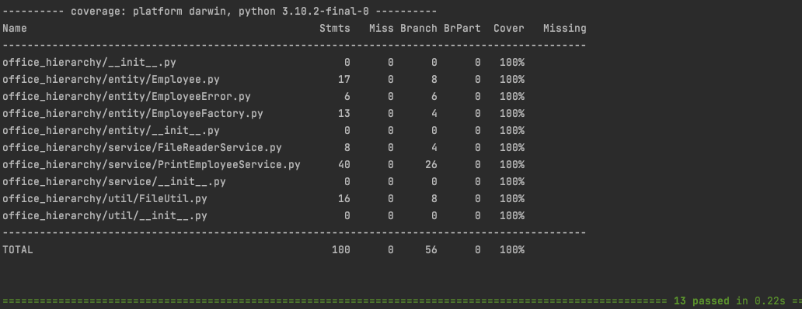

# innova_code_challenge

# ENVIRONMENT
- python version 3.10.2
- pytest version 7.1.1
- pydantic version 1.9

# OBJECTIVE
- read JSON file (content: employees)
- print office hierarchy

# PRINT OFFICE HIERARCHY
To run: `python3 ./src/main.py`
- Enter filename:
  - employees1
  - employees2
  - employees3
  - employees4
  - employees5
  - error_bad_json_format
  - error_pydantic_first_name

# EXAMPLE OUTPUT

# RUN PYTEST & CODE COVERAGE
To run: `pytest ./tests`

